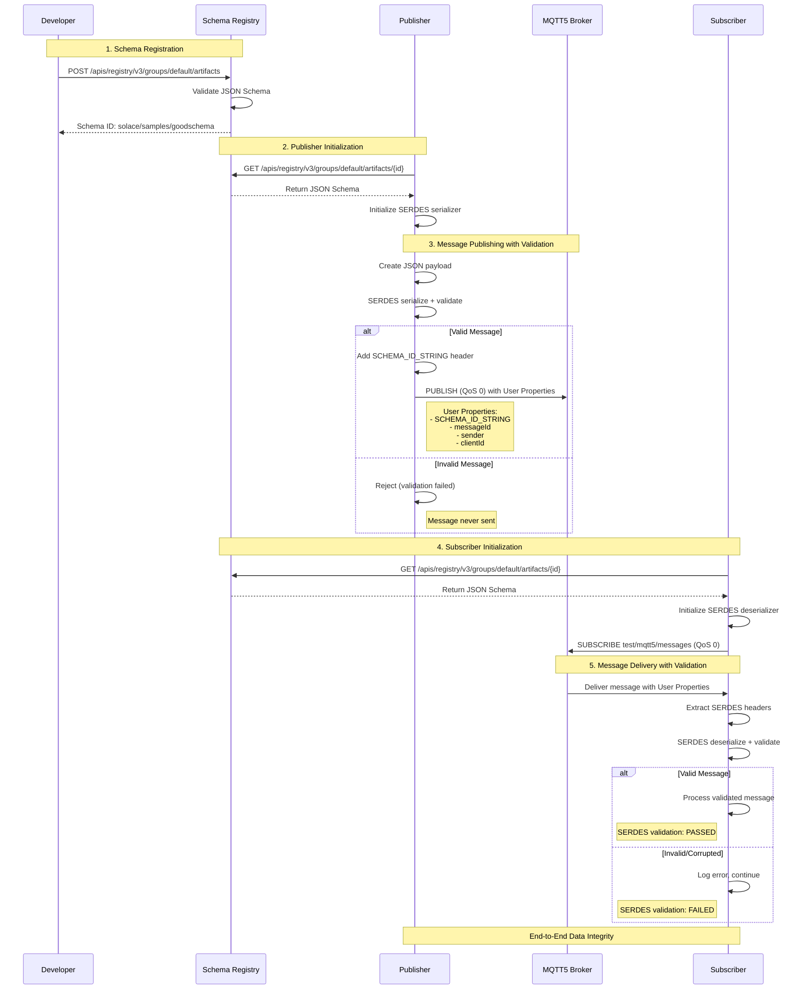
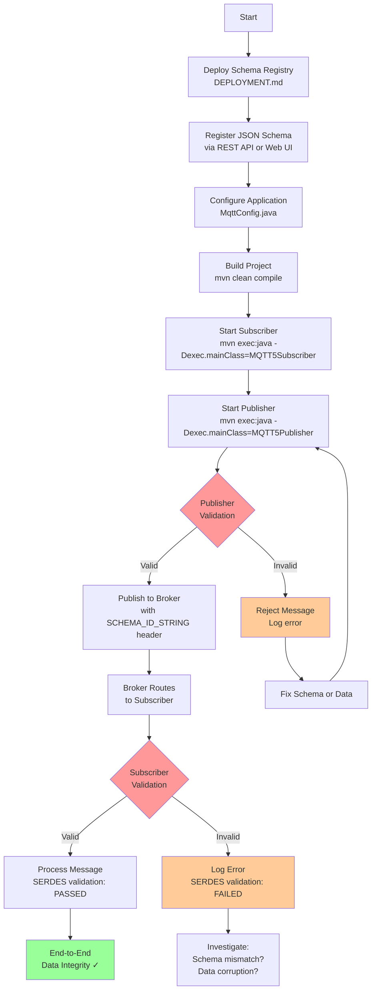

# MQTT5 + Solace Schema Registry Demo

A comprehensive demonstration of integrating MQTT5 with Solace Schema Registry for schema-validated messaging, deployed on AWS EKS.

## Overview

This project demonstrates:
- Deploying Solace Schema Registry on AWS EKS with PostgreSQL backend
- Building MQTT5 publisher and subscriber applications in Java
- Implementing end-to-end schema validation using JSON Schema
- Leveraging MQTT5 User Properties for schema metadata propagation
- Achieving data integrity and quality through client-side validation

## Architecture

### Infrastructure

```
Publisher (Java) → MQTT5 Broker (Solace) → Subscriber (Java)
      ↓                                            ↓
Schema Registry (AWS EKS) ←────────────────────────┘
      ↓
PostgreSQL (CloudNativePG)
```

### Message Flow with Validation



### Development Workflow




## Project Structure

```
mqtt5SRDemo/
├── src/main/java/
│   ├── MQTT5Publisher.java    # Publisher with schema validation
│   ├── MQTT5Subscriber.java   # Subscriber with schema validation
│   ├── MqttConfig.java         # Configuration management
│   └── SerdesSupport.java      # SERDES helper utilities
├── infra/
│   ├── eks-cluster.yaml        # AWS CloudFormation for EKS
│   ├── schema-registry-ecr.yaml # ECR repositories
│   ├── values-override.yaml.example # Helm values template
│   └── scripts/
│       └── upload_image.sh     # Image upload automation
├── DEPLOYMENT.md               # Complete deployment guide for AWS EKS
├── README.md                   # This file
└── pom.xml                     # Maven dependencies
```

## Quick Start

### Prerequisites

- Java 11 or higher
- Maven 3.6+
- AWS CLI configured (if deploying on AWS)
- kubectl
- Helm 3
- Solace PubSub+ broker (Cloud, software, or appliance)
- Access to Solace Schema Registry images

### 1. Deploy Schema Registry

Schema Registry must be deployed separately. You have two options:

**Option A: Deploy on AWS EKS** (Covered in this repo)

See **[DEPLOYMENT.md](DEPLOYMENT.md)** for complete step-by-step instructions covering:
- AWS EKS cluster setup with CloudFormation
- ECR repository creation and image upload
- PostgreSQL deployment with CloudNativePG
- Schema Registry installation with Helm
- NGINX Ingress with TLS configuration
- Troubleshooting and production considerations

**Option B: Deploy on Other Platforms**

The Schema Registry can be deployed on:
- Google Kubernetes Engine (GKE)
- Azure Kubernetes Service (AKS)
- On-premises Kubernetes
- OpenShift

The Helm chart and deployment approach is similar across platforms. Adjust the infrastructure setup (storage classes, load balancers) for your environment.

### 2. Configure the Application

Edit `src/main/java/MqttConfig.java`:

```java
// For Solace Cloud
public static final String BROKER_URL = "ssl://your-broker.messaging.solace.cloud:8883";
public static final String USERNAME = "your-username";
public static final String PASSWORD = "your-password";

// Schema Registry settings
public static final String SCHEMA_REGISTRY_URL = "https://your-schema-registry-url";
public static final String SCHEMA_ARTIFACT_ID = "solace/samples/goodschema";
```

### 3. Register the Schema

Use the Schema Registry Web UI or REST API to register your JSON schema:

```json
{
  "$schema": "http://json-schema.org/draft-07/schema#",
  "type": "object",
  "properties": {
    "name": { "type": "string" },
    "id": { "type": "string" },
    "email": { "type": "string", "format": "email" }
  },
  "required": ["name", "id", "email"]
}
```

Artifact ID: `solace/samples/goodschema`

### 4. Build the Project

```bash
mvn clean compile
```

### 5. Run the Subscriber

In one terminal:

```bash
mvn exec:java -Dexec.mainClass="MQTT5Subscriber"
```

### 6. Run the Publisher

In another terminal:

```bash
mvn exec:java -Dexec.mainClass="MQTT5Publisher"
```

## Key Features

### End-to-End Validation

- **Publisher**: Validates messages against schema before publishing
- **Subscriber**: Validates incoming messages against schema
- **Data Integrity**: Protection from source to destination

### MQTT5 Features Demonstrated

- User Properties for metadata propagation
- Message Expiry Interval
- Content Type and Payload Format indicators
- QoS 0 and QoS 1 messaging
- Clean Start and Session Expiry

### Schema Management

- JSON Schema validation using Solace SERDES
- String-based schema identifiers (artifact IDs)
- Backward compatibility with non-SERDES clients
- Centralized schema registry

## Documentation

### Key Implementation Details

**Publisher Header Pre-population:**
```java
// Pre-populate SCHEMA_ID_STRING for subscriber compatibility
serdesHeaders.put("SCHEMA_ID_STRING", MqttConfig.SCHEMA_ARTIFACT_ID);
outBytes = serializer.serialize(MqttConfig.SCHEMA_ARTIFACT_ID, jsonNode, serdesHeaders);
```

**Subscriber Header Filtering:**
```java
// Extract only SERDES-specific headers
Map<String, Object> serdesHeaders = new HashMap<>();
for (UserProperty prop : userProps) {
    String key = prop.getKey();
    if (key.equals("SCHEMA_ID_STRING") || key.startsWith("solace.schema.")) {
        serdesHeaders.put(key, prop.getValue());
    }
}
```

## Dependencies

Major dependencies (see `pom.xml` for complete list):

- Eclipse Paho MQTT v5 Client: 1.2.5
- Solace Schema Registry SERDES (JSON): 1.0.0
- Jackson Databind: 2.18.1
- SLF4J: 2.0.16

## Testing

The publisher includes built-in validation tests:
- Messages 1, 2, 4, 5, 7, 8, 10, 11, 13, 14, 16, 17, 19, 20: Valid
- Messages 3, 6, 9, 12, 15, 18: Invalid (missing/malformed email)

Expected behavior:
- Valid messages published and validated on both ends
- Invalid messages rejected at publisher with clear error messages

## Configuration Options

### MqttConfig.java

- `BROKER_URL`: MQTT broker endpoint
- `USERNAME`, `PASSWORD`: Authentication credentials
- `TOPIC_BASE`: Base topic for publishing/subscribing
- `PUBLISH_QOS`, `SUBSCRIBE_QOS`: Quality of Service levels
- `SCHEMA_REGISTRY_URL`: Schema Registry endpoint
- `SCHEMA_ARTIFACT_ID`: Schema identifier
- `JSON_SERDES_ENABLED`: Enable/disable validation
- `JSON_PUBLISH_WITH_SERDES`: Enable publisher validation
- `JSON_SUBSCRIBE_WITH_SERDES`: Enable subscriber validation

## Troubleshooting

### SSL/TLS Certificate Issues

If using self-signed certificates in development:

```bash
# Export certificate from browser or get from server
openssl s_client -connect your-registry:443 -showcerts

# Import to Java truststore
sudo keytool -import -alias schema-registry \
  -keystore $JAVA_HOME/lib/security/cacerts \
  -file registry-cert.crt
```

### Connection Issues

- Verify MQTT broker URL and credentials
- Check firewall rules for ports 8883 (MQTTS) and 443 (HTTPS)
- Ensure Schema Registry is accessible from your network

### Schema Not Found

- Verify artifact ID matches exactly (case-sensitive)
- Check schema is registered in the correct group
- Confirm Schema Registry URL is correct

## Production Considerations

Before deploying to production:

1. **Security**
   - Use CA-signed TLS certificates
   - Integrate with enterprise identity provider (LDAP/OIDC)
   - Enable RBAC for Schema Registry
   - Use AWS Secrets Manager for credentials

2. **High Availability**
   - Deploy multiple Schema Registry replicas
   - Use PostgreSQL with 3+ replicas
   - Configure EKS across multiple AZs
   - Set up pod disruption budgets

3. **Monitoring**
   - Enable Prometheus metrics
   - Configure alerting for validation failures
   - Monitor message latency and throughput
   - Track schema registry API performance

4. **Backup & Recovery**
   - Configure PostgreSQL backups
   - Document schema registry restore procedures
   - Test disaster recovery scenarios

## Resources

- [Solace PubSub+ Cloud](https://solace.com/products/platform/cloud/)
- [Solace Schema Registry Documentation](https://docs.solace.com/Cloud/Schema-Registry/schema-registry-overview.htm)
- [Solace Schema Registry Codelab](https://codelabs.solace.dev/codelabs/schema-registry/index.html)
- [Eclipse Paho MQTT5 Documentation](https://www.eclipse.org/paho/files/mqttdoc/MQTTClient/html/index.html)
- [JSON Schema Documentation](https://json-schema.org/)
- [CloudNativePG Documentation](https://cloudnative-pg.io/)

## License

This project is provided as-is for demonstration and educational purposes.

## Contributing

Issues and pull requests are welcome!

## Author

Matt Stobo - [GitHub](https://github.com/mstobo)

